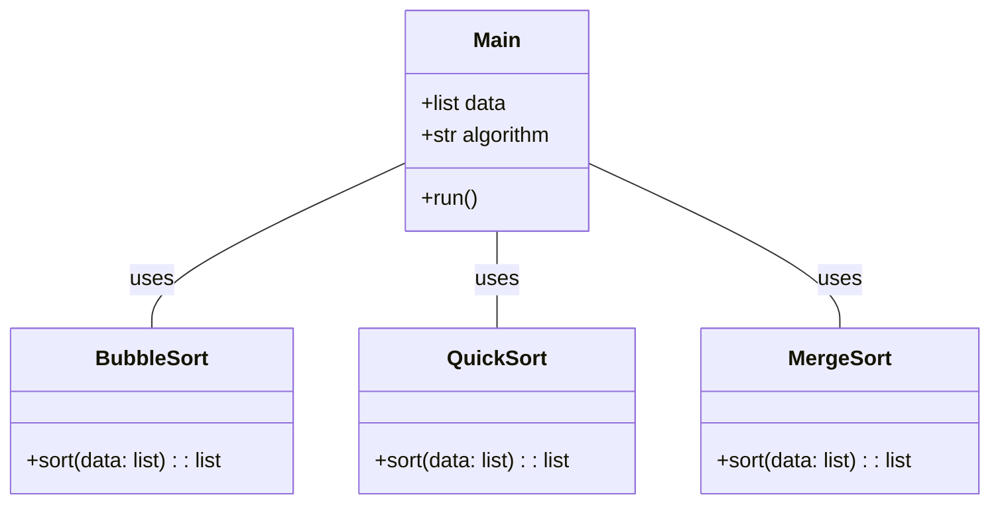
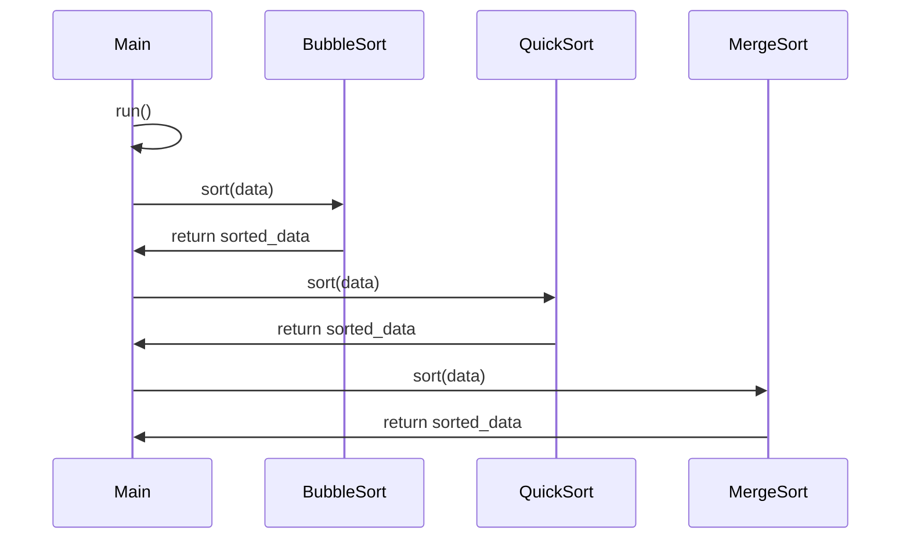

## Implementation approach
We will use Python to implement this system. The system will be a console-based application that allows users to input an array of integers, choose a sorting algorithm, and then display the sorted array.

The three sorting algorithms we will implement are Bubble Sort, Quick Sort, and Merge Sort. These algorithms are chosen for their varying efficiencies and use cases.

We will use the argparse library to handle user input and choices. This library allows us to easily create user-friendly command-line interfaces.

The numpy library will be used for array manipulations and to ensure efficient computations.

The time library will be used to measure the performance of the sorting algorithms.

## Python package name
```python
"sorting_algorithms"
```

## File list
```python
[
    "main.py",
    "bubble_sort.py",
    "quick_sort.py",
    "merge_sort.py",
    "sort_utils.py"
]
```

## Data structures and interface definitions


## Program call flow


## Anything UNCLEAR
The requirement is clear to me.